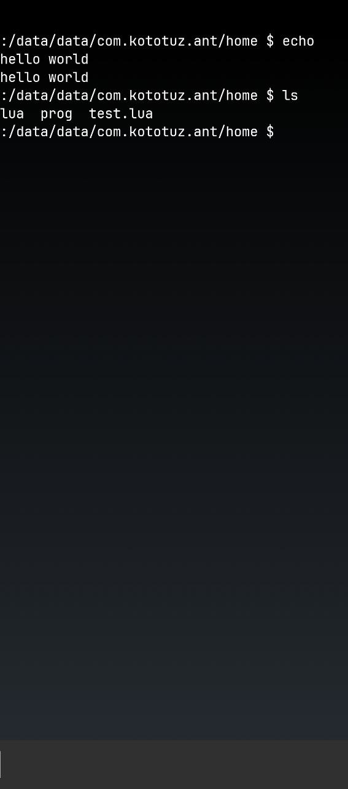

# ANdroid Terminal - ant

## Preview

<p align=center>
  
</p>

## Description

This is a simple terminal android emulator.
I created this project because i want to develop
programs for Android not **android applications**.

## Dependencies

- Android SDK
- Android NDK
- Java

## Quick Start

Override `SDK` and `NDK` variables in `build.sh`.
And then type:

``` console
./build.sh
```

It will create an apk file and try to send this apk
to connected device or emulator.

## Usage

You can run programs only in the application directory.
Well, and in this way you can't just type `./<exe>` (idk why).
To run executable type `$r <exe> <args>` (`$r` will expands to
`linker64 ``pwd``/<exe> <args>`)
